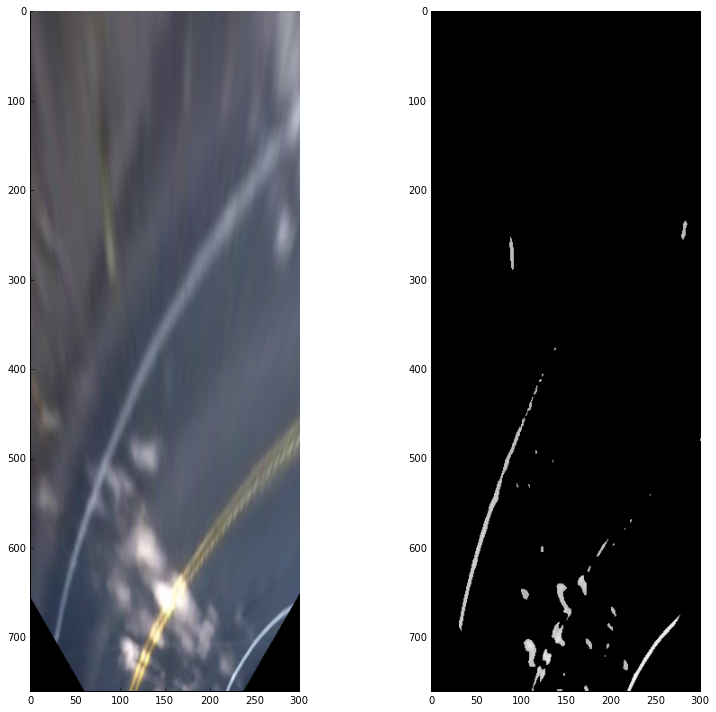

# Advanced Lane Finding

The goal of this project is to create a software pipeline to identify the lane boundaries in a video, as well as determining possible and actual problems and pitfalls during that.

## The Project

The goals / steps of this project are the following:

* Compute the camera calibration matrix and distortion coefficients given a set of chessboard images.
* Apply a distortion correction to raw images.
* Use color transforms, gradients, etc., to create a thresholded binary image.
* Apply a perspective transform to rectify binary image ("birds-eye view").
* Detect lane pixels and fit to find the lane boundary.
* Determine the curvature of the lane and vehicle position with respect to center.
* Warp the detected lane boundaries back onto the original image.
* Output visual display of the lane boundaries and numerical estimation of lane curvature and vehicle position.

The images for camera calibration are stored in the folder called `camera_cal`.  The images in `test_images` are for testing your pipeline on single frames.  If you want to extract more test images from the videos, you can simply use an image writing method like `cv2.imwrite()`, i.e., you can read the video in frame by frame as usual, and for frames you want to save for later you can write to an image file.

The `challenge_video.mp4` video is an extra (and optional) challenge to test the pipeline under somewhat trickier conditions. The `harder_challenge.mp4` video is another optional challenge and is brutal!

### Camera Calibration

#### 1. Briefly state how you computed the camera matrix and distortion coefficients. Provide an example of a distortion corrected calibration image.

The procedure and code for this step is drafted IPython notebook located in [./notebooks/1_camera_calibration.ipynb](notebooks/1_camera_calibration.ipynb); the final implementation can be found in [`./pipeline/transform/CameraCalibration.py`](pipeline/transform/CameraCalibration.py).

Given a series of images of checkerboard patterns taken with the camera, a transformation matrix and distortion parameters are obtained, which are then used to undistort images from the video stream.
First, 3D virtual world coordinates of the checkerboard corners are defined, assuming that the board is positioned directly on the X/Y plane (at Z=0). By doing so, the object points are fixed for each calibration image
and the camera is assumed to move, rather than (conceptually) moving the checkerboard in front of a fixed camera. Whenever edge points are detected, they are appended to an array of locations per image,
which is then fed to OpenCV's `cv2.calibrateCamera()` function. The resulting output can be used with `cv2.undistort()` to undistort future images.

The following image shows the original calibration pattern, as well as a refined undistorted representation (using `cv2.getOptimalNewCameraMatrix()`) that shows the amount of pincushion distortion in the original images.
Here, black pixels are invalid pixels that lie outside the original image frame. Only the contents inside the red region of interest are going to be used for further processing.

Note that since the refined representation reduces the amount of valid pixels, it is only shown here for demonstration purposes but not actually used in the code.

### Pipeline (single images)

> Abandon all hope, ye who enter here. ~ Dante Alighieri, Inferno (Divine Comedy, part 1)

#### 1. Provide an example of a distortion-corrected image.

The following image shows an example from the original video (on the left), as well as its undistorted version that is used for processing (on the right).

Again, to showcase the amount of distortion, this is the actual representation of the distorted image with the biggest region containing only valid pixels being shown in red. Note that the region of interest is of a different
aspect ratio than the original image, leading to a slightly smaller visible area for processing if the original image geometry is used. Since this only affects pixels at the sides of the image, this is not much of a concern.

#### 2. Describe how (and identify where in your code) you performed a perspective transform and provide an example of a transformed image.

The whole procedure is extensively documented in the [./notebooks/2_birds_eye_view.ipynb](notebooks/2_birds_eye_view.ipynb) notebook. The eventual implementation can be found in [`./pipeline/transform/BirdsEyeView.py`](pipeline/transform/BirdsEyeView.py).

In order to obtain a top-down view on the street, a "bird's eye view" transformation was performed. For this, four points in the image were picked and refined in such a way that they (as closely as possible) represent physically correct distances.
Since I was unable to find clear regulations on lane widths and dashes, I used a close-up view of the [Juniperro Serra freeway](https://www.google.de/maps/@37.4441459,-122.2584509,74m/data=!3m1!1e3) ([Interstate 280](https://en.wikipedia.org/wiki/Interstate_280_(California))), the area the video was
taken at, on Google Maps and sampled different measurements (lane widths, dash-to-dash distance, dot-to-dot distances, dash lengths etc.), taking the averages.

This lead to the conclusion that a lane width is about 3.6576 meters, while the distance between dashes is 13.8826 meters. I then selected and refined edge coordinates of a trapezoid in the original image for perspective distortion using OpenCV's `cv2.getPerspectiveTransform()` and `cv2.warpPerspective()` functions.

After selecting and refining a trapezoid in the original image and designing a transformation such that the distance between the left and right lane line in the transformed image is exactly 100 pixels, with additional 100 pixels to the left and right, 
I then overlaid expected distances on the transformed image, that I visually confirmed the expectations. Here, the green lines represent locations where dots are expected to be, while the blue lines
mark beginnings and ends of dashes. The red lines are drawn at 100 ± 10 px and 200 ± 10 px.

The selected source and destination points consequently are

| Location     | Source        | Destination   |
|:------------:|:-------------:|:-------------:|
| Bottom left  | 290, 660      | 100, 759.11   |
| Top left     | 580, 461.75   | 100, 0        |
| Top right    | 702, 461.75   | 200, 0        |
| Bottom right | 1013, 600     | 200, 759.11   |

#### 3. Describe how (and identify where in your code) you used color transforms, gradients or other methods to create a thresholded binary image.  Provide an example of a binary image result.

The notebook [./notebooks/3_thresholding.ipynb](notebooks/3_thresholding.ipynb) documents my experiments.

Inspecting the video material showed the occurrence of the following lane types:

- White, dashed lines (`project_video.mp4`, `challenge_video.mp4`),
- white, solid lines (`harder_challenge_video.mp4`),
- yellow, solid lines (e.g. `project_video.mp4`) and
- double, yellow, solid lines (`harder_challenge_video.mp4`).

However, applying a naive grayscale transformation shows rather quickly that the apparent "brightness" of the yellow lines is, in reality, not necessarily higher than the surrounding street; instead, it is mainly the saturation of the
color that makes it stand out:

Multiple color space transformations were performed in order to identify a single or multiple color representations that allow successfully picking pixels that likely represent lane lines.

The HLS (Hue, Lightness, Saturation) color space seems to isolates the yellow line pretty much in the saturation channel, while having a high lightness value for the white lines, so appears to be a promising choice for color range picking.
However, running the same experiment on a low-contrast image with heavy direct sunlight and blown-out intensities, showed that the saturation channel is not at all stable.

Instead, I found that selecting the (computationally much more expensive) L\*a\*b\* transform for this kind of task appears to be more reliable: The lightness (L\*) channel still is blown-out given the direct sunlight, however the b\* channel - since it encodes the blue-yellow plane - still reports the yellow line comparatively good. The YUV transformation exhibits similar behavior, but resulted in slightly worse (apparent) quality. Here's a rendering of the selected color space for a different street scene, clearly showing how the (color-free) white lines are not represented in any of the color channels, while the yellow line clearly stands out.

A range limit was used for the green-red channel, as extreme green and red values likely do not belong to lane lines. This assumption definitely is only valid in the context of the project video, as night-light scenarios or regulations in different countries might prove the theory wrong.

In addition to that, I was also experimenting with:

- Combining value ranges from different color spaces,
- Automatically selecting value ranges by means of genetic algorithms (specifically, [Differential Evolution](https://docs.scipy.org/doc/scipy/reference/generated/scipy.optimize.differential_evolution.html)), conditioned on achieving maximum overlap with a set of (poorly) hand-drawn lane locations, given windowed histogram features of the image,
- Applying luminance constancy techniques loosely borrowed from [Retinex Theory](https://en.wikipedia.org/wiki/Color_constancy),
- Using contrast-limited adaptive histogram equalization techniques (CLAHE),
- Using windowed regular histogram equalization techniques.

Benchmarking against the "harder challenge" video which contains drastical brightness changes and shadows, the assumption is that using a statically defined threshold for value picking is, in general, the wrong approach.

Thus, rather than using color picking for thresholding (e.g. using OpenCV's `cv2.inRange()` function), a different approach was taken in L\*a\*b\* space, given the previous obervations. First, the yellow tones are isolated using simple clipping: Since the b\* channel encodes blue vs. yellow, half of the color range can already be discarded as not being of interest. Likewise, as already stated, extreme green and red tones (from the a\* channel) can also be ignored.
Both the lightness and "yellow" channel are then undergoing a power transform that keeps bright pixel values in place while "pushing down" darker ones; this effectively counters brighter street scenes (like the first image in this section), where the yellow line would otherwise still be darker than its surroundings in the lightness channel. The yellow and lightness channels are then combined using a simple maximum operator (`cv2.max()`) and renormalized to `0..1` range.

The following image shows the result of the `lab_enhance_yellow()` function, implemented in [`./pipeline/preprocessing.py`](pipeline/preprocessing.py).

##### Edge detection

Next, edge detection was performed on the grayscale image. Different experiments were done and tested against the videos, for which documentation can be found in the notebooks [./notebooks/4_edge_detection.ipynb](notebooks/4_edge_detection.ipynb), [./notebooks/4_edge_detection_take2.ipynb](notebooks/4_edge_detection_take2.ipynb) and [./notebooks/5_masks_edges_combined.ipynb](notebooks/5_masks_edges_combined.ipynb). The final implementations can be found as the `EdgeDetection*.py` and [`LaneColorMasking.py`](pipeline/edges/LaneColorMasking.py) classes in [`./pipeline/edges`](pipeline/edges).

Canny edge detection proved to work fine in general scenarios, but created a lot of false positives in trees and bushes, as can be seen in the following image.

Since the following steps are based on a intensity peak detection in "lane pixel candidate" space, this kind of distraction can poison the detection into moving off screen pretty quickly.

A necessary condition for a lane line is that it is, indeed, brighter than its surroundings. We consequently require an edge sequence to be going from black to bright, then from bright to black; if it doesn't, we're indeed looking at a black line.
Given that the gradient directions should cancel out in a given window around the lane line, we can use convolution techniques (e.g. a simple box filter that sums up all the gradients) to suppress single-edge lines, or custom kernels designed
to pick up bright lines.
Using further morphological transforms such as closing to join remaining segments, blurring and thresholding, we can obtain some approximation of the lane lines.

Another observation abouth the lane lines is that they are (meant to be) of the same width. This lead me to exploring a technique borrowed from Optical Character Recognition (OCR), called [Stroke Width Transform](https://www.microsoft.com/en-us/research/publication/stroke-width-transform/); same as for lane lines, lines forming characters are small variations of the same stroke thickness and connecting lines of identical stroke width allows detecting what's likely text.
Ignoring the last part, a re-used an experimental Python implementation I did [here](https://github.com/sunsided/stroke-width-transform) to

- Detect edges using the Canny algorithm,
- follow found edges "up" into the brighter area and
- traveling a minimum distance and expecting a "down" edge within a maximum distance.

Whenever this criterion is fulfilled, the pixels traveled are considered to be lane lines, leading to somewhat promising results.

However, although SWT is assumed to be fast, my naive Python implementation is far from that, which resulted in this technique being slower than everything else.

It also occurred to me that the images are, in reality, never observed in isolation. Instead, it can be assumed that pixels on lane lines mostly won't change much in brightness and color across frames, whereas pixels belonging to background will change drastically. Given this knowledge, temporal filtering can be used to suppress rapidly changing edges. Simultaneously, keeping a long-term integration of the images allows to accurately suppress reflections of the dashboard in the screen that would otherwise trigger false vertical edges in bright sunlight. However, while making some progress, it did not turn out to be the perfect solution. An example of lane line proposals can be seen in [this](https://www.youtube.com/watch?v=n1aZLTyl9BI) YouTube video.

Lastly, Template Matching techniques were explored. Here, I sampled positive and negative examples for detecting lane lines and performed normalized cross-correlation based matching against the window. Although being an extremely simple approach, it proved to be the most promising one, outperforming the other massively. Here's the pipeline from the color image to yellow-enhanced grayscale conversion, blurring and Template Matching.

The following image shows a detection after thresholding.

Attempts to combine different edge detection and color picking techniques were ultimately discarded as leading to too many false positives or suppressing too many valid pixels, resulting in loss of track or almost impossible cold-start initialization.

#### 4. Describe how (and identify where in your code) you identified lane-line pixels and fit their positions with a polynomial?

Then I did some other stuff and fit my lane lines with a 2nd order polynomial kinda like this:

![alt text][image5]

#### 5. Describe how (and identify where in your code) you calculated the radius of curvature of the lane and the position of the vehicle with respect to center.

I did this in lines # through # in my code in `my_other_file.py`

#### 6. Provide an example image of your result plotted back down onto the road such that the lane area is identified clearly.

I implemented this step in lines # through # in my code in `yet_another_file.py` in the function `map_lane()`.  Here is an example of my result on a test image:

![alt text][image6]

---

### Pipeline (video)

#### 1. Provide a link to your final video output.  Your pipeline should perform reasonably well on the entire project video (wobbly lines are ok but no catastrophic failures that would cause the car to drive off the road!).

Here's a [link to my video result](./project_video.mp4)

---

### Discussion

#### 1. Briefly discuss any problems / issues you faced in your implementation of this project.  Where will your pipeline likely fail?  What could you do to make it more robust?

- Video is not adaptive to lighting changes

