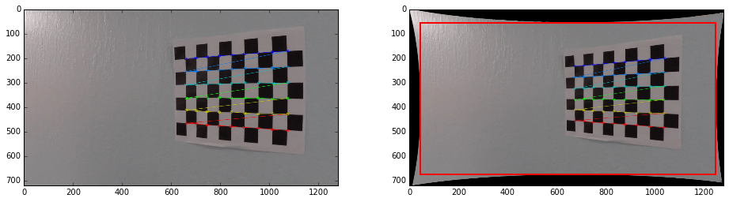
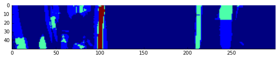

# Advanced Lane Finding

[](http://www.udacity.com/drive)

The goal of this project is to create a software pipeline to identify the lane boundaries in a video, as well as determining possible and actual problems and pitfalls during that.
A result of running the implemented pipeline on the project video can be seen at [https://www.youtube.com/watch?v=6-eFJ7o5GO4](https://www.youtube.com/watch?v=6-eFJ7o5GO4).

<a href="https://www.youtube.com/watch?v=6-eFJ7o5GO4"></a>

## The Project

The goals / steps of this project are the following:

* Compute the camera calibration matrix and distortion coefficients given a set of chessboard images.
* Apply a distortion correction to raw images.
* Use color transforms, gradients, etc., to create a thresholded binary image.
* Apply a perspective transform to rectify binary image ("birds-eye view").
* Detect lane pixels and fit to find the lane boundary.
* Determine the curvature of the lane and vehicle position with respect to center.
* Warp the detected lane boundaries back onto the original image.
* Output visual display of the lane boundaries and numerical estimation of lane curvature and vehicle position.

The images for camera calibration are stored in the folder called `camera_cal`.  The images in `test_images` are for testing your pipeline on single frames.
If you want to extract more test images from the videos, you can simply use an image writing method like `cv2.imwrite()`, i.e., you can read the video in frame
by frame as usual, and for frames you want to save for later you can write to an image file.

The `challenge_video.mp4` video is an extra (and optional) challenge to test the pipeline under somewhat trickier conditions. The `harder_challenge.mp4` video
is another optional challenge and is brutal!

### Camera Calibration

#### 1. Obtaining a camera matrix and performing distortion correction

The procedure and code for this step is drafted IPython notebook located in [./notebooks/1_camera_calibration.ipynb](notebooks/1_camera_calibration.ipynb);
the final implementation can be found in [`./pipeline/transform/CameraCalibration.py`](pipeline/transform/CameraCalibration.py).

Given a series of images of checkerboard patterns taken with the camera, a transformation matrix and distortion parameters are obtained, which are then used to
undistort images from the video stream. First, 3D virtual world coordinates of the checkerboard corners are defined, assuming that the board is positioned
directly on the X/Y plane (at Z=0). By doing so, the object points are fixed for each calibration image and the camera is assumed to move, rather than (conceptually)
moving the checkerboard in front of a fixed camera. Whenever edge points are detected, they are appended to an array of locations per image, which is then fed to
OpenCV's `cv2.calibrateCamera()` function. The resulting output can be used with `cv2.undistort()` to undistort future images.

The following image shows the original calibration pattern, as well as a refined undistorted representation (using `cv2.getOptimalNewCameraMatrix()`) that shows the
amount of pincushion distortion in the original images. Here, black pixels are invalid pixels that lie outside the original image frame. Only the contents inside the
red region of interest are going to be used for further processing.



Note that since the refined representation reduces the amount of valid pixels, it is only shown here for demonstration purposes but not actually used in the code.

### Pipeline (single images)

> Abandon all hope, ye who enter here. ~ Dante Alighieri, Inferno (Divine Comedy, part 1)

#### 1. Provide an example of a distortion-corrected image.

The following image shows an example from the original video (on the left), as well as its undistorted version that is used for processing (on the right).


Again, to showcase the amount of distortion, this is the actual representation of the distorted image with the biggest region containing only valid pixels being shown
in red. Note that the region of interest is of a different aspect ratio than the original image, leading to a slightly smaller visible area for processing if the original
image geometry is used. Since this only affects pixels at the sides of the image, this is not much of a concern.


#### 2. Perspective transformation to "Bird's Eye View"

The whole procedure is extensively documented in the [./notebooks/2_birds_eye_view.ipynb](notebooks/2_birds_eye_view.ipynb) notebook. The eventual implementation can be found in [`./pipeline/transform/BirdsEyeView.py`](pipeline/transform/BirdsEyeView.py).

In order to obtain a top-down view on the street, a "bird's eye view" transformation was performed. For this, four points in the image were picked and refined in such a way
that they (as closely as possible) represent physically correct distances. Since I was unable to find clear regulations on lane widths and dashes, I used a close-up view of
the [Juniperro Serra freeway](https://www.google.de/maps/@37.4441459,-122.2584509,74m/data=!3m1!1e3) ([Interstate 280](https://en.wikipedia.org/wiki/Interstate_280_(California))),
the area the video was taken at, on Google Maps and sampled different measurements (lane widths, dash-to-dash distance, dot-to-dot distances, dash lengths etc.), taking the averages.


This lead to the conclusion that a lane width is about 3.6576 meters, while the distance between dashes is 13.8826 meters. I then selected and refined edge coordinates
of a trapezoid in the original image for perspective distortion using OpenCV's `cv2.getPerspectiveTransform()` and `cv2.warpPerspective()` functions.


After selecting and refining a trapezoid in the original image and designing a transformation such that the distance between the left and right lane line in the transformed
image is exactly 100 pixels, with additional 100 pixels to the left and right, I then overlaid expected distances on the transformed image, that I visually confirmed the
expectations. Here, the green lines represent locations where dots are expected to be, while the blue lines mark beginnings and ends of dashes.
The red lines are drawn at 100 ± 10 px and 200 ± 10 px.


The selected source and destination points consequently are

| Location     | Source        | Destination   |
|:------------:|:-------------:|:-------------:|
| Bottom left  | 290, 660      | 100, 759.11   |
| Top left     | 580, 461.75   | 100, 0        |
| Top right    | 702, 461.75   | 200, 0        |
| Bottom right | 1013, 600     | 200, 759.11   |

#### 3. Color transforms, gradients and thresholding for lane line pixel proposals

The notebook [./notebooks/3_thresholding.ipynb](notebooks/3_thresholding.ipynb) documents my experiments.

Inspecting the video material showed the occurrence of the following lane types:

- White, dashed lines (`project_video.mp4`, `challenge_video.mp4`),
- white, solid lines (`harder_challenge_video.mp4`),
- yellow, solid lines (e.g. `project_video.mp4`) and
- double, yellow, solid lines (`harder_challenge_video.mp4`).


However, applying a naive grayscale transformation shows rather quickly that the apparent "brightness" of the yellow lines is, in reality,
not necessarily higher than the surrounding street; instead, it is mainly the saturation of the color that makes it stand out:


Multiple color space transformations were performed in order to identify a single or multiple color representations that allow successfully picking pixels
that likely represent lane lines.


The HLS (Hue, Lightness, Saturation) color space seems to isolate the yellow line pretty much in the saturation channel, while having a high lightness value for
the white lines, so appears to be a promising choice for color range picking. However, running the same experiment on a low-contrast image with heavy direct sunlight
and blown-out intensities showed that the saturation channel is not at all stable.


Instead, I found that selecting the (computationally much more expensive) L\*a\*b\* transform for this kind of task appears to be more reliable: The lightness (L\*) channel
still is blown-out given the direct sunlight, however the b\* channel - since it encodes the blue-yellow plane - still reports the yellow line comparatively good.
The YUV transformation exhibits similar behavior, but resulted in slightly worse apparent quality. Here's a rendering of the selected color space for a different street scene,
clearly showing how the yellow line clearly stands out, while the (color-free) white lines do not interefere there and can be found easily in the lightness channel.


A range limit was used for the green-red channel, as extreme green and red values likely do not belong to lane lines. This assumption definitely is only valid in the context
of the project video, as night-light scenarios or regulations in different countries might prove the theory wrong.

In addition to that, I was also experimenting with:

* Combining value ranges from different color spaces,
* Automatically selecting value ranges by means of genetic algorithms (specifically, [Differential Evolution](https://docs.scipy.org/doc/scipy/reference/generated/scipy.optimize.differential_evolution.html)), conditioned on achieving maximum overlap with a set of (poorly) hand-drawn lane locations, given windowed histogram features of the image, so that different lighting situations would pick different color ranges,
* Applying luminance constancy techniques loosely borrowed from [Retinex Theory](https://en.wikipedia.org/wiki/Color_constancy),
* Using contrast-limited adaptive histogram equalization techniques (CLAHE),
* Using windowed regular histogram equalization techniques.

Constantly benchmarking against the "harder challenge" video which contains drastical brightness changes and shadows, I came to the conclusion that using a statically
defined threshold for value picking is, in general, the wrong approach.

Thus, rather than using color picking for thresholding (e.g. using OpenCV's `cv2.inRange()` function), a different approach was taken in L\*a\*b\* space, given the previous
obervations. First, the yellow tones are isolated using simple clipping: Since the b\* channel encodes blue vs. yellow, half of the color range can already be discarded as not
being of interest. Likewise, as already stated, extreme green and red tones (from the a\* channel) can also be ignored.
Both the lightness and "yellow" channel are then undergoing a power transform that keeps bright pixel values in place while "pushing down" darker ones; this effectively counters
issues with brighter street scenes (like the first image in this section), where the yellow line would otherwise still be darker than its surroundings in the _lightness_ channel.
The channels are then combined using a simple maximum operator (`cv2.max()`) and renormalized to `0..1` range.

The following image shows the result of the `lab_enhance_yellow()` function, implemented in [`./pipeline/preprocessing.py`](pipeline/preprocessing.py).


##### Edge detection

Next, edge detection was performed on the grayscale image. Different experiments were done and tested against the videos, for which documentation can be found in the
notebooks [./notebooks/4_edge_detection.ipynb](notebooks/4_edge_detection.ipynb), [./notebooks/4_edge_detection_take2.ipynb](notebooks/4_edge_detection_take2.ipynb) and [./notebooks/5_masks_edges_combined.ipynb](notebooks/5_masks_edges_combined.ipynb). The final implementations can be found as the `EdgeDetection*.py` and `LaneColorMasking.py`
classes in [`./pipeline/edges`](pipeline/edges).

Canny edge detection proved to work fine in general scenarios, but created a lot of false positives in trees and bushes, as can be seen in the following image.


Since the following steps are based on a intensity peak detection in "lane pixel candidate" space, this kind of distraction can poison the detection into moving off screen pretty quickly.
Probabilistic Hough transforms and [Line Segment Detectors](https://docs.opencv.org/3.0-beta/modules/line_descriptor/doc/LSDDetector.html) were evaluated but eventually discarded
as well.

A necessary condition for a lane line is that it is, indeed, brighter than its surroundings. We consequently require an edge sequence to be going from black to bright,
then from bright to black; if it does the opposite, we're actually looking at a black line and if it never steps back, it is just a single edge, e.g. a shadow or sunlight spot.
Given that the gradient directions should cancel out in a given window around the lane line, we can use convolution techniques to suppress single-edge lines, or custom kernels
designed to pick up bright lines; for example, if edge gradients do cancel out in a given window, a simple box filter results in a zero response there, while being nonzero for
all other edges. Using further morphological transforms such as closing to join remaining segments, blurring and thresholding, we can obtain some approximation of the lane lines.


Another observation abouth the lane lines is that they are usually of the same width. This lead me to exploring a technique borrowed from Optical Character Recognition (OCR),
called [Stroke Width Transform](https://www.microsoft.com/en-us/research/publication/stroke-width-transform/): Like with lane lines, lines forming characters have only small
variations of the same stroke thickness and connecting pixels within segments of identical stroke width allows detecting what's likely showing text.
While skipping the connected components part, I re-used an experimental Python implementation I did [here](https://github.com/sunsided/stroke-width-transform) to

* Detect edges using the Canny algorithm,
* follow found edges "up" into the brighter area,
* traveling a required minimum distance and
* expecting a "down" edge within an allowed maximum distance.

Whenever this criterion is fulfilled, the pixels traveled are considered to be lane lines, leading to somewhat promising results.


However, although SWT is assumed to be fast, my naive Python implementation is far from that, which resulted in this technique being slower than everything else.

It also occurred to me that the images are, in reality, never observed in isolation. Instead, it can be assumed that pixels on lane lines mostly won't change much in brightness
and color across frames, whereas pixels belonging to background will change drastically. Given this knowledge, temporal filtering can be used to suppress rapidly changing edges.
Simultaneously, keeping a long-term integration of the images allows to accurately suppress reflections of the dashboard in the screen that would otherwise trigger false vertical
edges in bright sunlight. However, while making some progress, it did not turn out to be the perfect solution. Intermediate result of lane line proposals from temporal filtering
are shown in [this](https://www.youtube.com/watch?v=n1aZLTyl9BI) YouTube video.

<a href="https://www.youtube.com/watch?v=n1aZLTyl9BI"></a>

Lastly, Template Matching techniques were explored. Here, I sampled positive and negative examples for detecting lane lines and background respectively and performed normalized
cross-correlation based matching against the grayscale image. The resulting map would then be genreated by multiplying the normalized sum of positive responses with the inverse
of the normalized sum of background responses. Although being an extremely simple approach, it proved to be the most promising one, outperforming the others drastically. Here's
the pipeline from the color image to yellow-enhanced grayscale conversion, blurring and Template Matching.


Each template cost up to 10ms on my machine, which is already one third of the time budget for a 30 FPS video sequence, but the processing helped a bit. Obviously, not the whole
image needs to be processed to verify whether a single edge belongs to a lane or not, but this kind of optimization is left for another day. The following image shows a detection
after applying some thresholding.


Attempts to combine different edge detection and color picking techniques were ultimately discarded as leading to too many false positives or suppressing too many valid pixels,
resulting in loss of track or almost impossible cold-start initialization. An example of a possible outcome of detection combination can be seen in the following image, where
extremely bright spots and reflections lead to too many highlighted areas.


Here's a somewhat friendlier setup when nonbinary values are allowed; here, blue represents no candidates while red suggests strong support of lane lines.


#### 4. Indentifying lane-line pixels and fiting a polynomial

The detection of lane lines is outlined in the [./notebooks/6_lane_line_regression.ipynb](notebooks/6_lane_line_regression.ipynb) notebook and implemented in the [`./pipeline/lanes/LaneDetection.py`](pipeline/lanes/LaneDetection.py) class.

A search window starting from the bottom of the warped image is defined. The following image depicts the outcome of an earlier version of the proposal when combination
techniques were still used, again in false-color representation:



From this view, a histogram of column-wise intensities is generated with the goal of identifying the (X-axis) offsets that most probably contain lane lines.


In this histogram, peaks identify locations where lane lines are most likely to be found. It also shows a problem of the combination approach: A lot of "low importance" features
can quickly add up to a peak, as can be seen at location `x=50`. If a binary threshold would have been used instead of "continuous" values, this scenario would have looked less
dramatic. However, this heavily relies on a good threshold selection as well as a "nice" scenario, as this window selection shows:


Here, the peaks clearly have shifted to the left, bootstrapping the search at utterly wrong positions, given that we expect lane lines to be close to the locations `x=100` and
`x=200` by design.


This goes to show that a bad proposal generation easily throws off the whole pipeline in an instance.

From the obtained seed positions, a marching boxes approach is used to detect a local trend in intensity shift using a similar local histogram-based algorithm: Starting two
search windows at the seed positions on the bottom of the image (here, red for the left and cyan for the right lane line), each subsequent higher window is centered at the
X location of highest columnwise intensity sums, i.e. histogram peaks. By doing so, the search windows follow the position of mean intensity, eventually "climbing up" the lane
line. When not enough pixels are found within a box, the current position is assumed to be the center of the following window, thus searching "straight" up from the current position.
Eventually a stopping condition is triggered when the search window leaves the frame to either side or was unable to find enough pixels for a defined number of times. If enough
boxes are found, a second-order polynomial is fitted through their center coordinates; these fits are shown in yellow color in the following image.


In friendly scenarios, this plays out fine, as the following image shows:


However, a bad initialization or noise in the image quickly leads to degraded results, as can be seen in this result:


When a fit has been found, the next iteration will attempt to reuse it directly: Along the fit, search windows are evaluated and a new confidence value is calculated. If there
is enough support, the fit is adjusted to the new rectangles. Only if this approach fails, the whole search pipeline is restarted.

Some improvements were added to this general idea:

* A local fit of the last boxes is used to steer the search to follow the local curvature. The idea here is that even if a box is missing, the lane line might still be curved, so search straight up either is fruitless or leads to a vastly broken fit.
* The bottom-most box is discarded for the fit as it - being a seed position - is not necessarily agreeing with the remaining boxes.
* Each fit is re-evaluated for support in the image to obtain a confidence measure of the lane line estimate. This is especially helpful if a lane line search is off by accident, leaving the actual track and being re-confirmed in a distance. In such kind of fit, the "missed" boxes count against the confidence.
* Actual fits are finally averaged over a given history set using a Gaussian weighting scheme and the confidence in order to build a low-pass filter that is meant to be resilient to sudden changes.

#### 5. Determining radius of curvature and deviation from the lane center

The calculation of the curvature of the line fit is implemented in [./pipeline/curvature.py](pipeline/curvature.py) and normalized to meters by making use of the first and second
derivative of the quadratic fit (`f(x) = ax^2 + bx + c`).
Specifically, the curvature is given as

```python
def curvature_radius(fit, y: float, mx: float) -> float:
    coeff_a, coeff_b, coeff_c = fit
    if coeff_a == 0:
        return CURVATURE_INVALID
    radius = ((1. + (2. * coeff_a * y + coeff_b) ** 2.) ** 1.5) / (2. * coeff_a)
    return radius * mx
```

That is the square root of (one plus (the square of (the curve's first derivate `f'(x) = 2*a*x + b`)) raised to the power of three) divided by the curve's second derivative `f''(x) = 2*a`.

Since the lane lines are designed to be positioned at the locations `x=100` and `x=200`, we know that the lane center is expected to be at `x=150`. By taking the arithmetic
mean of the _actual_ lane positions at the bottom of the image and determining the deviation from the expected position, we can (by normalizing) determine the absolute deviation from
the lane center in percent (of a half half) and, ultimately, meters.

#### 6. Rendering the results into the original image

Finally, the fit is backprojected using the inverse perspective transform and rendered onto the original (undistorted) video frame.


---

### Discussion

#### 1. Discussions of problems and pitfalls

The implemented pipeline is far from perfect and definitely tailored towards the scenarios observed in the project videos. Because of that, most assumptions that are taken are
likely to be invalid if the time of the day, the sky or simply the country changes. For example, if a lane fit is lost, one could argue that "staying at the right" side of the
lane is a good idea - that is, unless you are in Britain, Hong Kong etc., where people drive on the left. At night, the color of the white lane lines might shift to a blue or
red tint, depending on the street lights, so color corrections would be required.

A lot of trouble in the challenge videos also comes from the static exposure setup of the camera. If the camera was able to adjust for overexposure e.g. by reducing shutter times,
clearer views on the street could be obtained without having to fiddle around with thresholds that much. Reflections of the dashboard could be reduced by finding a better placement
of the camera to begin with, etc. Losing track of lane lines requires to rely on information of previous fits, however most of the operations are performed in isolation, missing the
spatio-temporal correlations between frames. Furthermore, even though a lot of information could be extracted from the video feed only e.g. using point tracking, adaptive approaches
such as Kalman and particle filters could be used to their full power if more information about the physical system was known, such as sensor input from the wheels, accelerometer data,
etc. For example, lane fits could be evolved over time given that we know the direction of the wheels and the current speed.

When the street is not flat or the lane is oriented orthogonal to the camera, all assumptions about the orientation of edges are basically invalid. That means that when entering a
road, obtaining an understanding of lanes is close to impossible. And even if the lane is oriented with the view, the lane line might either not exist or be hidden to begin with,
as it is in certain parts of the "harder challenge" video. Relying on intensity spikes only can also be a problem in the presence of bright metal surfaces such as a crash barrier,
so some more engineering is required there as well.

Most of the operations are done in vain: For example, it is not required to perform edge detection, convolutions or template matching on the whole image if only a fraction of it is
going to be searched anyway. When search restarts from a previous fit, only edges within and/or around the previous search windows need to be calculated. Likewise, if search is starting
from scratch, a edges in the bottom part of the image are required in addition to the search windows. Most of the time, the edges of the top of the image never are evaluated. Likewise,
calculation intensive operations such as template matching can be performed on locations where lane lines are expected only; that is, rather than convolving the whole image with the
templates, a Canny detector can be used to obtain _possible_ lane lines, which then need to be verified or discarded using a more exact algorithm. This kind of cascaded operation helps
speeding up e.g. face detections like the Viola-Jones algorithm and are, generally speaking, suitable to this scenario as well.

Searching the lane line using marching boxes - which is susceptible to errors in the proposal generation, as was shown above - could be avoided entirely in favor of directly attempting
to fit a polynomial or spline using probabilistic approaches such as RANSAC, where the search could be conditioned with information from previous frames as well. Using superpixel
techniques such as SLIC on the original image before performing edge detection could help reducing noise while isolating lane lines from their surroundings. However, as the template
matching approach has shown, relying on thresholds and channel combinations might just be the wrong approach to tackle this problem. The next time around, I would treat the whole project
as a machine learning problem where polynomial or spline coefficients would be predicted directly from the image. It certainly makes the whole project a data problem, rather than an
engineering one, but even the naive template matching outcomes look much more promising than anything else I tried.
